# WEB端使用说明

点击[链接](https://run-web-app.pre-env.cae001.com/projects)进入WEB端。

## 模态分析

在通用模块中点击结构模态分析软件。

### 导入网格文件

目前可以导入.inp格式的网格文件。点击工具栏中添加网格模型，弹出对话框，点击浏览文件，选择.inp文件，如下图。可以选择FENGSim/starter/ccx/oiltank路径中的modal.inp文件。

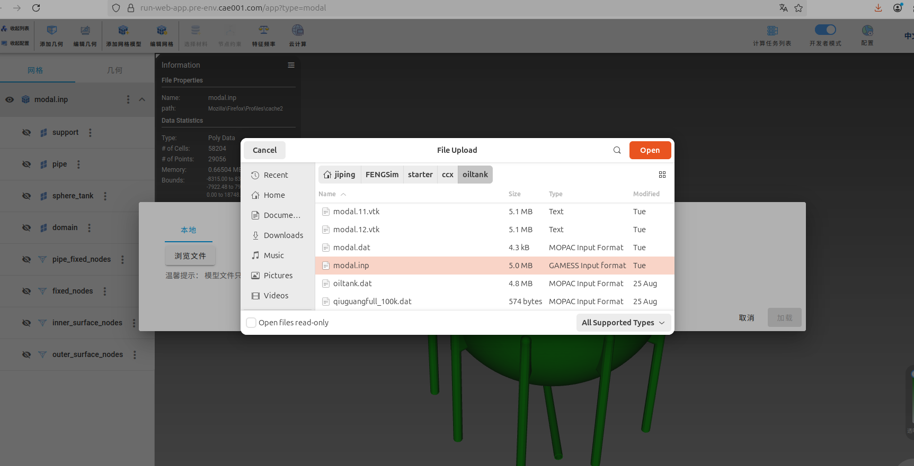

导入网格文件后可以看到下图。

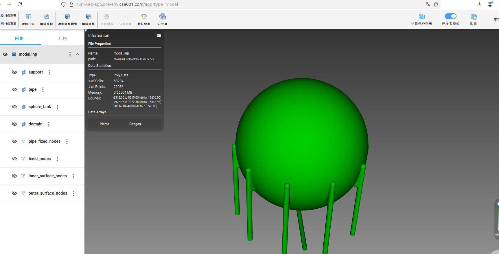

### 设置材料

如上图，在左侧工具栏中有网格文件的树形结构。modal.inp是根节点，子节点包括单元组和节点组，support、pipe、sphere\_tank为单元组，pip\_fixed\_nodes、fixed\_nodes、inner\_surface\_nodes、outer\_surface\_nodes为节点组。点击support，再点击工具栏中的选择材料，再点击材料模型<mark>（这个材料模型是否去掉，或者增加另外一个选项 ）</mark>，弹出对话框，如下图，可以选择Aluminum alloys，点击右下角应用按钮确认。同样对pipe和sphere\_tank两个单元组进行操作。

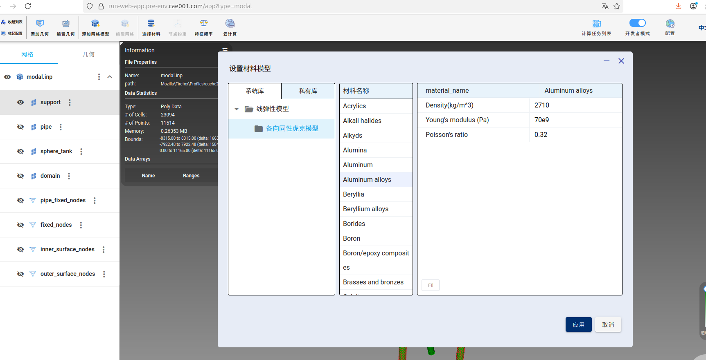

### 设置边界条件

对于模态分析来说，可以不设置边界条件，或者设置homogeneous Dirichlet边界条件。在左侧工具栏中选择fixed\_nodes节点组，点击上侧工具栏中的节点约束，弹出对话框，选择开关打开时，位移为零，如下图，点击应用确认。

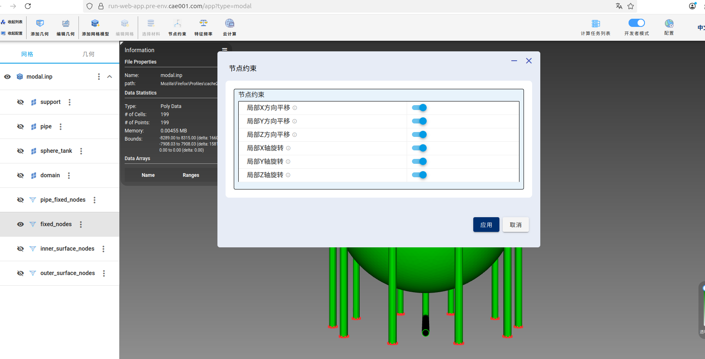

### 提交任务

点击工具栏中的云计算，弹出对话框，如下图，输入项目名称为储油罐，选择三维和米单位，点击右下角确认。

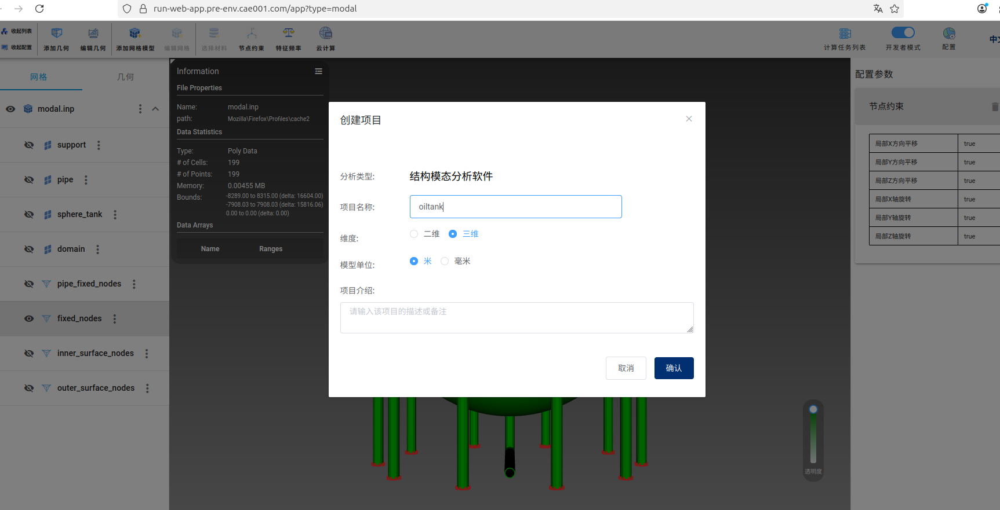

弹出下图中对话框，点击上传网格，上传成功后字体颜色会变成绿色。

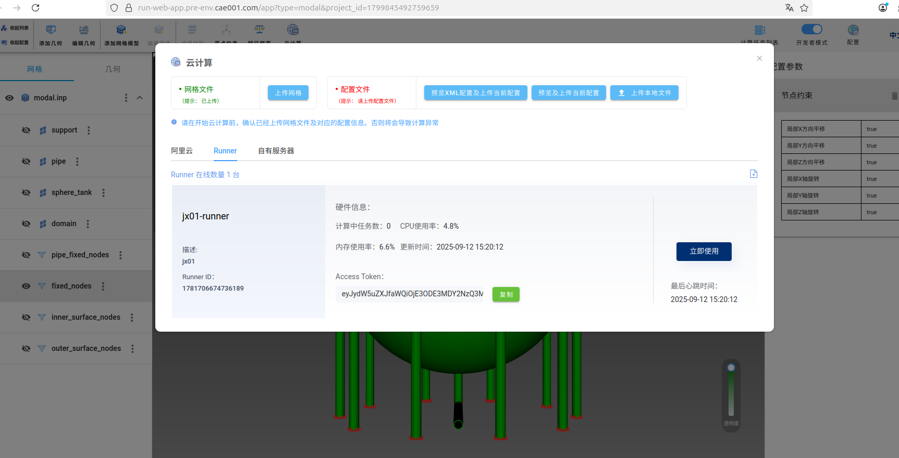

再点击预览XML配置及上传当前配置，弹出对话框，如下图。点击右下角上传当前配置，上传成功后字体颜色会变成绿色。

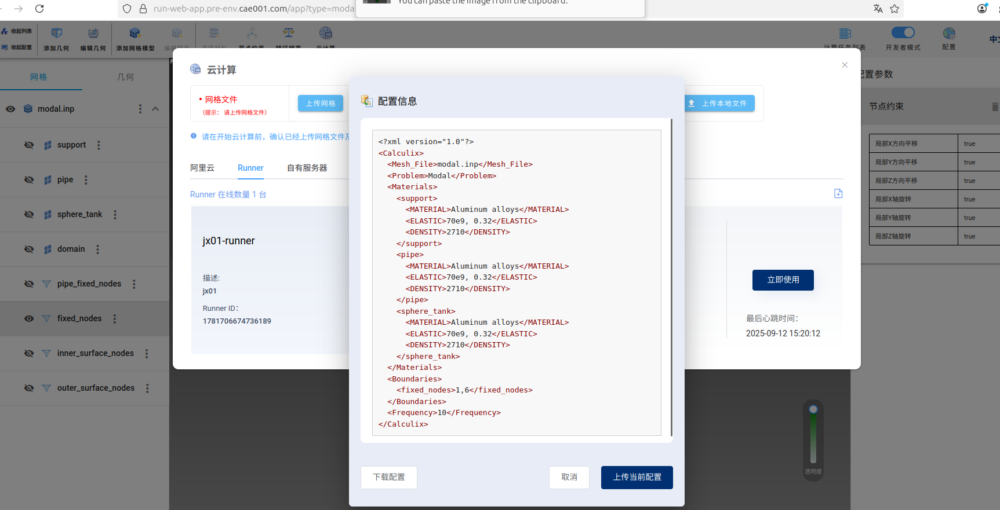

再点击下图中右下侧的立即使用，即可提交云端计算。

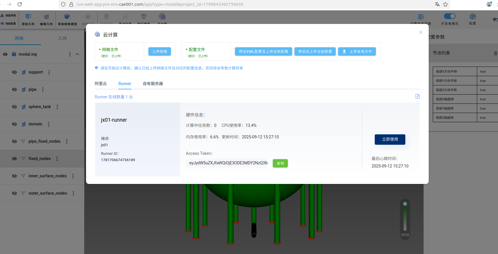

计算完成后，如下图。

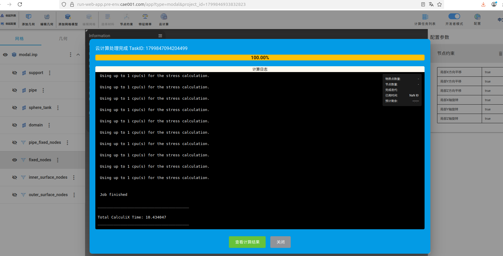

点击查看计算结果，会重新打开一个新的WEB窗口，如下图。

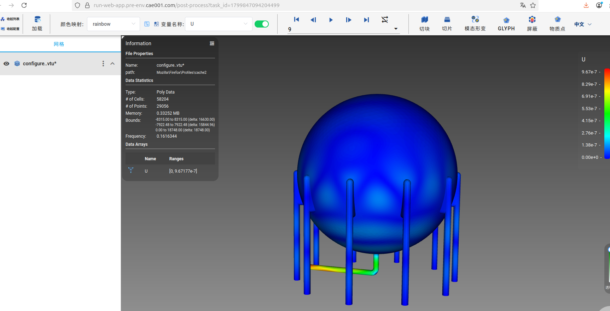

点击左上角的打开列表，点击configure，该选项显示10个模态的云图，点击configure左侧的眼睛，先将云图隐藏。再点击上侧工具栏右边的模态形变，弹出下图对话框。

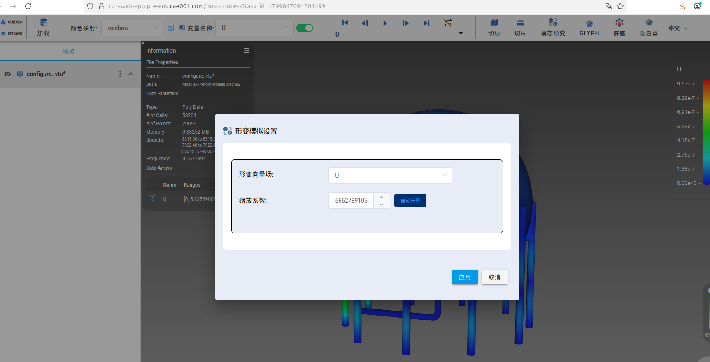

点击应用确认，如下图。点击左侧工具栏中的warp_configure，可以选择不同阶数的模态，然后点击上侧工具栏中的视频播放，可以查看该阶数模态的动画。对应的频率，可以在Information信息栏中查看。

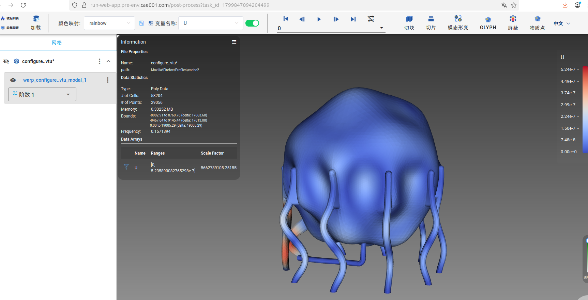
