# WEB端使用说明

点击[链接](https://run-web-app.pre-env.cae001.com/projects)进入WEB端。

## 机械臂模块

在通用模块中点击多体动力学分析。

### 导入网格文件

一次性导入机械臂stl模型和轨迹规划。点击上侧工具栏中添加网格模型，弹出对话框，点击浏览文件，选择stage1.stl、stage2.stl、down.stl、upper.stl、wrist.stl、hand.stl和ur3.traj，如下图。可以在FENGSim/starter/mbdyn/robot路径中找到这些文件。

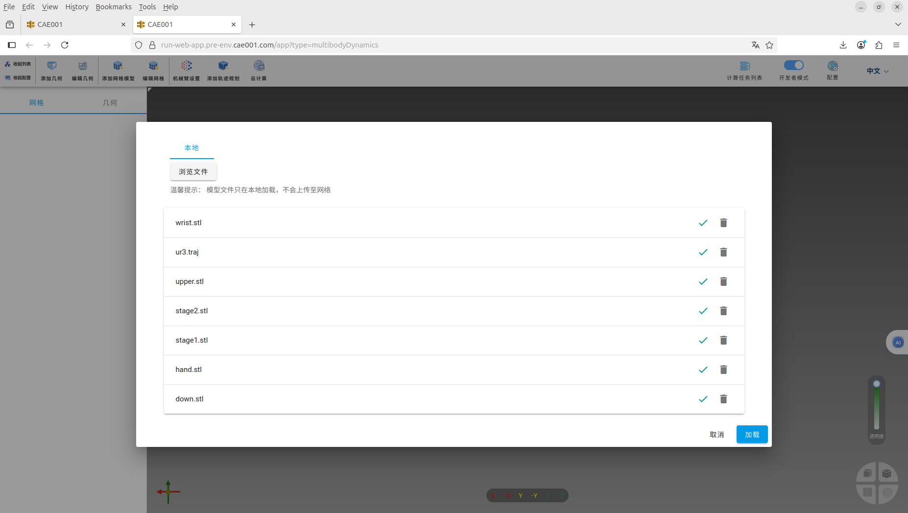

点击右下角加载，可以看到下图。

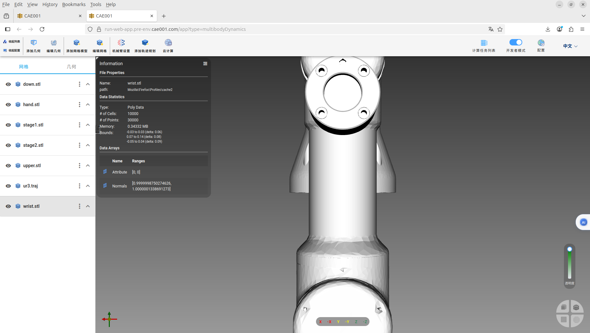

### 设置机械臂

点击上侧工具栏中的机械臂设置，弹出对话框，如下图。

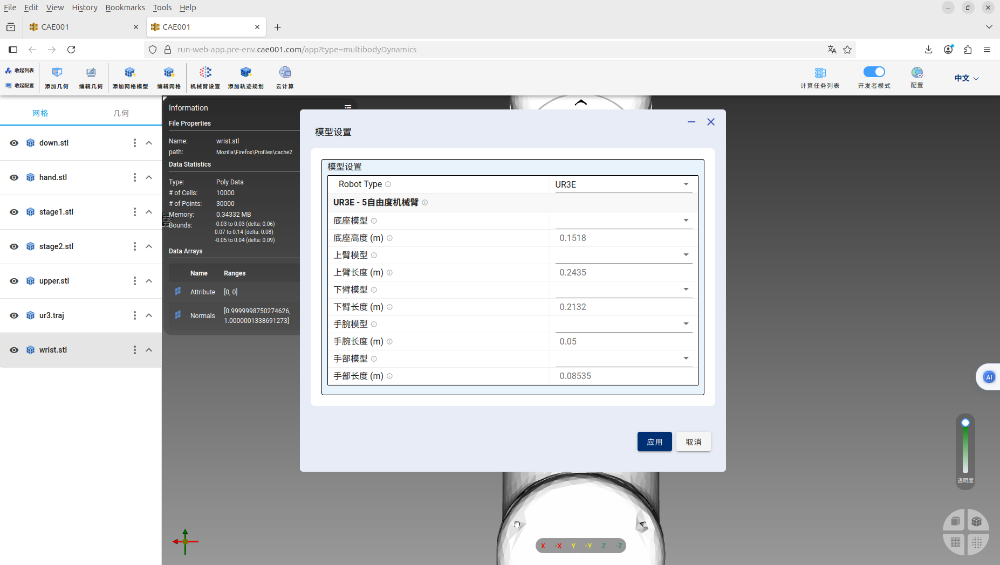

将底座模型设置为stage2.stl，上臂模型设置为upper.stl，下臂模型设置为down.stl，手腕模型设置为wrist.stl，手部模型设置为hand.stl，如下图。

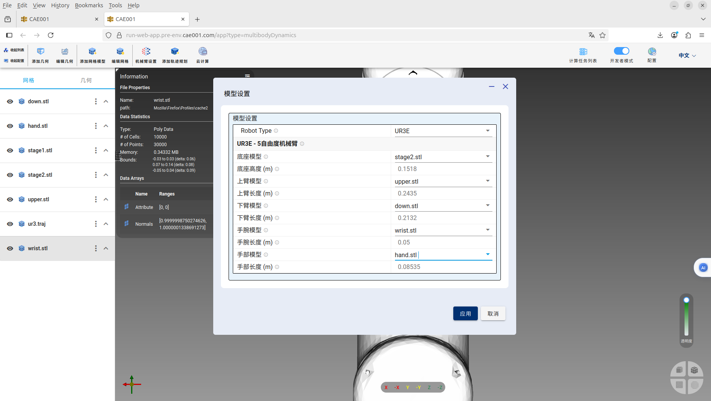

点击右下角应用，可以看到下图。

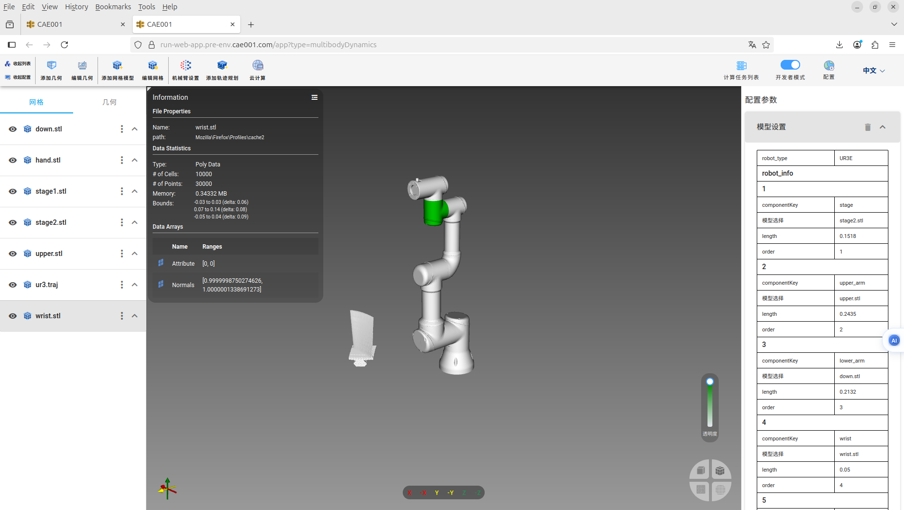

### 提交任务

点击上侧工具栏中的云计算，弹出对话框，如下图，输入项目名称为mbdyn，选择三维和米单位，点击右下角确认。

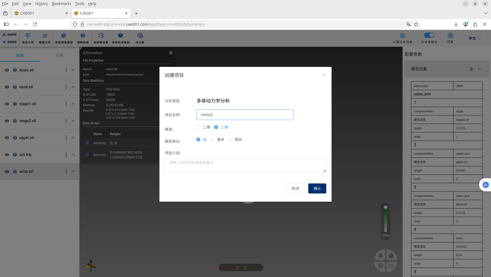

弹出下图中对话框，点击上传网格，上传成功后字体颜色会变成绿色。

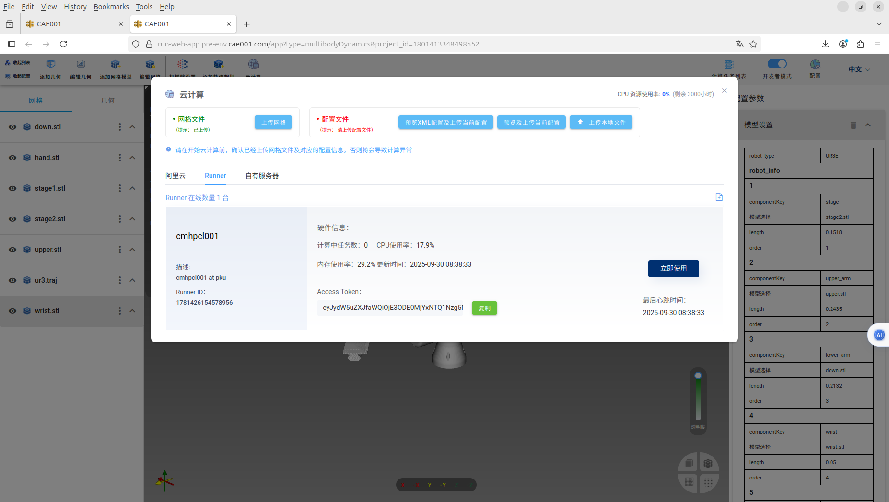

再点击预览XML配置及上传当前配置，弹出对话框，如下图。点击右下角上传当前配置，上传成功后字体颜色会变成绿色。

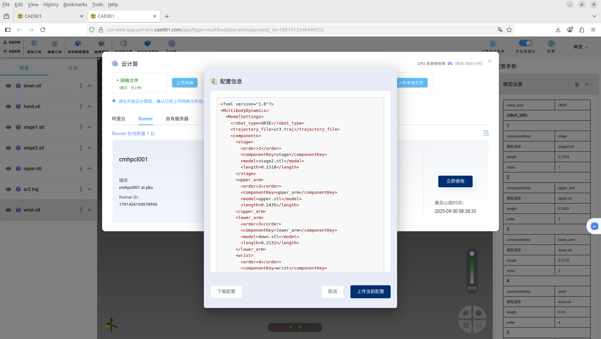

可以选择不同的服务器，点击下图中立即使用，即可提交云端计算。

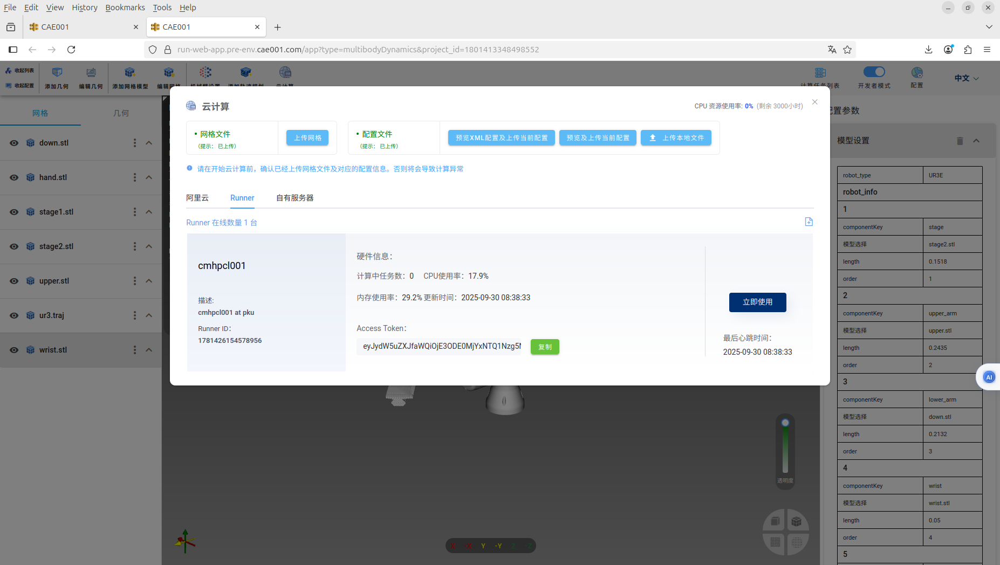

计算完成后，如下图。

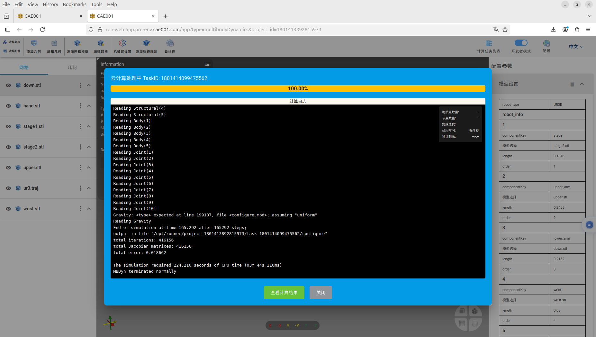

点击查看计算结果，会重新打开一个新的WEB窗口，如下图。

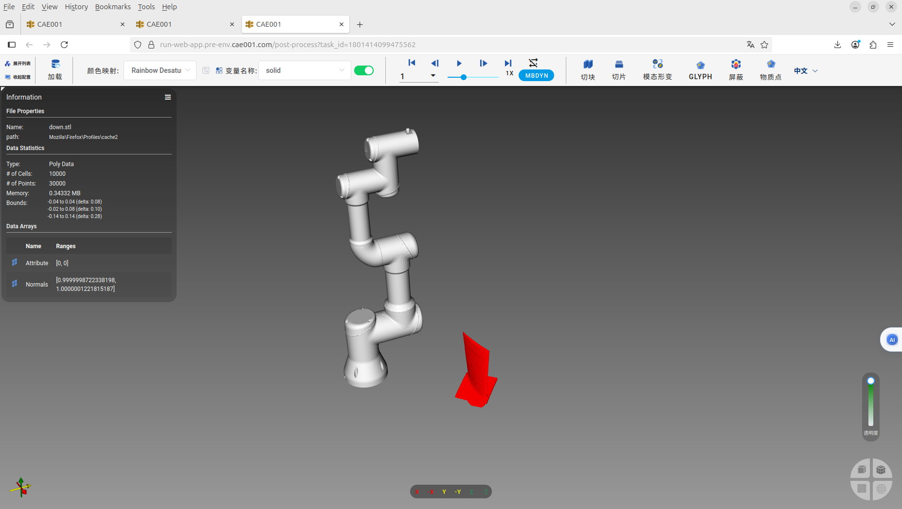

点击上侧工具栏中的动画播放箭头按钮，可以查看机械臂的运动过程。

### 界面设计建议

* 未来用户可以选择现成机械臂模型或者自己创建机械臂模型，如果是现成机械臂模型就不用自己导入stl数模，也不用再自己设置机械臂参数了。
