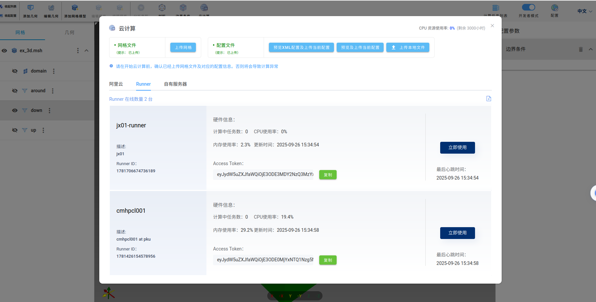

# WEB端使用说明

点击[链接](https://run-web-app.pre-env.cae001.com/projects)进入WEB端。

## 电磁分析

在通用模块中点击电磁分析软件。

### 导入网格文件

目前可以导入Gmsh生成的.msh格式的网格文件。点击上侧工具栏中添加网格模型，弹出对话框，点击浏览文件，选择.msh文件，如下图。可以选择FENGSim/starter/palace/examples/spheres/mesh路径中的ex_3d.msh文件。

导入网格文件后可以看到下图。

### 设置分析类型

在上侧工具栏中点击分析类型，弹出对话框，选择静电，如下图，还可以选择其他几种，确定后右侧工具栏配置参数可以看到设置结果。

### 设置材料

如下图，在左侧工具栏中有网格文件的树形结构。ex_3d.msh是根节点，子节点包括体单元组和边界单元组，domain为体单元组，around、down、up为边界单元组。点击domain，再点击上侧工具栏中的材料，弹出对话框，如下图。因为分析类型选择了静电，只有介电常数需要设置，点击应用确认。同样右侧工具栏配置参数可以看到设置结果。

### 设置边界条件

点击around，再点击上侧工具栏中的边界条件，弹出对话框，如下图，选择零电荷边界条件，点击应用完成操作，右侧工具栏可以看到设置结果。类似操作将down设置成接地边界条件,up设置成端子边界条件。

### 提交任务

点击上侧工具栏中的云计算，弹出对话框，如下图，输入项目名称为Static Electricity，选择三维和米单位，点击右下角确认。

弹出下图中对话框，点击上传网格，上传成功后字体颜色会变成绿色。

再点击预览XML配置及上传当前配置，弹出对话框，如下图。点击右下角上传当前配置，上传成功后字体颜色会变成绿色。

可以选择不同的服务器，点击下图中立即使用，即可提交云端计算。

计算完成后，如下图。

点击查看计算结果，会重新打开一个新的WEB窗口，如下图。

点击上侧工具栏中的变量名称，选择电势V，如下图。

### 界面设计建议

* 边界条件设置后右侧工具栏好像没有显示。
