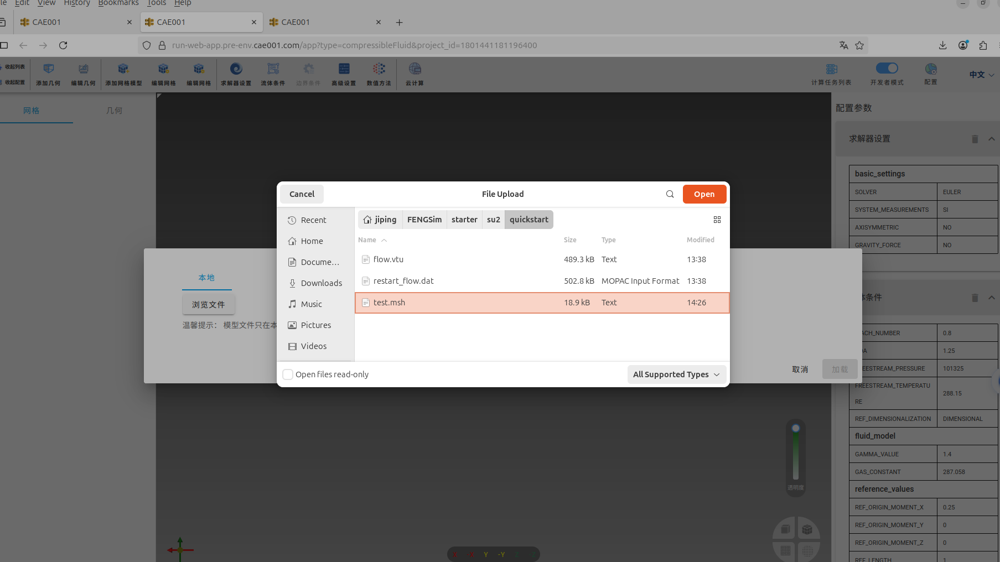
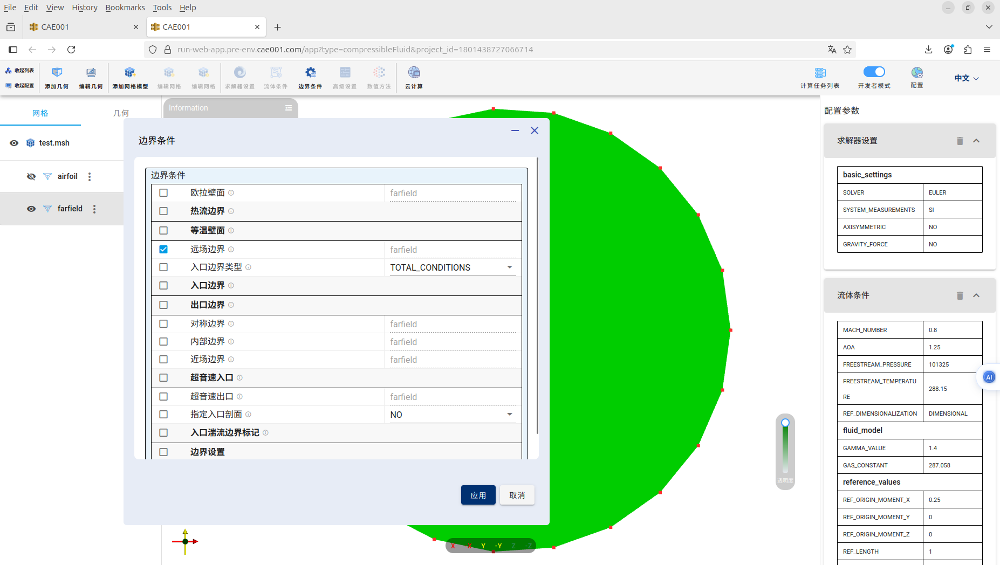

# WEB端使用说明

点击[链接](https://run-web-app.pre-env.cae001.com/projects)进入WEB端。

## 可压缩流体分析

在通用模块中点击可压缩流体分析。

### 导入网格文件

导入Gmsh生成的.msh文件。点击上侧工具栏中添加网格模型，弹出对话框，点击浏览文件，选择test.msh，如下图。可以在FENGSim/starter/su2/quickstart路径中找到这些文件。

点击右下角加载，可以看到下图。

### 设置求解器

左侧工具栏中有网格文件的树形结构，test.msh为根节点，为体单元组，airfoil和farfield为边界单元组。
点击左侧工具栏中的test.msh，再点击上侧工具栏中的求解器设置，弹出对话框，如下图，在问题类型中选择EULER，再点击应用确认。
右侧工具栏可以看到设置结果。

### 设置边界条件和状态方程

点击左侧工具栏中的airfoil，再点击上侧工具栏中的边界条件，弹出对话框，如下图，选择欧拉壁面，点击右下角应用确认。右侧工具栏可以看到设置结果。

点击左侧工具栏中的farfield，再点击上侧工具栏中的边界条件，弹出对话框，如下图，选择远场边界，点击右下角应用确认。右侧工具栏可以看到设置结果。

点击左侧工具栏中的test.msh，再点击上侧工具栏中的流体条件，弹出对话框，如下图，选择流体模型，选择比热比和气体常数，选择参考值，点击右下角应用确认。右侧工具栏可以看到设置结果。

### 设置数值方法

点击左侧工具栏中的test.msh，再点击上侧工具栏中的数值方法，弹出对话框，如下图，选择空间离散化，选择对流项数值格式为JST，点击右下角应用确认。右侧工具栏可以看到设置结果。

### 提交任务

点击上侧工具栏中的云计算，弹出对话框，如下图，输入项目名称为su2，选择三维和米单位，点击右下角确认。

弹出下图中对话框，点击上传网格，上传成功后字体颜色会变成绿色。

再点击预览XML配置及上传当前配置，弹出对话框，如下图。点击右下角上传当前配置，上传成功后字体颜色会变成绿色。

可以选择不同的服务器，点击下图中立即使用，即可提交云端计算。

计算完成后，如下图。

点击查看计算结果，会重新打开一个新的WEB窗口，如下图，在上侧工具栏中的变量名称中选择JST。

### 界面设计建议

* 主要设置为方程、边界条件、状态方程，现在流体条件里包括了边界条件，也包括了状态方程，然后还有一个单独的边界条件设置，最好重新合并下。
* 因为是个二维问题，最好能将视角固定成z轴。
